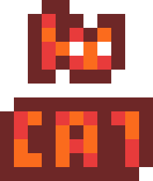

<div align="center">



<h1>TinyCat</h1>

<p>
  A tiny pixel-art cat that lives on your desktop.
</p>

<br>

<p>
  
  
   <br>
  Walks on desktop windows · Grab and throw · Cursor interaction
</p>


</div>

## System tray

Right-click the Tiny Cat icon in the system tray to open its menu.

- **Add Cat** creates another independent pet.
- **Exit** closes all cats and quits the application.

## Project layout

- `src/`: C++ source files and headers.
- `resources/`: Windows resource script, resource IDs, and icons.
- `assets/sprites/`: runtime sprite sheets.
- `assets/cursors/`: runtime cursor files.
- `docs/images/`: README previews and gameplay recordings.
- `build/bin/<platform>/<configuration>/`: executables and runtime assets.
- `build/obj/<platform>/<configuration>/`: compiler and linker intermediate files.
- `build/previous/`: preserved output folders from before the layout change (local only).

## Build

Open `TinyCat.vcxproj` in Visual Studio with the v145 C++ toolset and Windows SDK installed, or run this from a Developer PowerShell in the project root:

```powershell
msbuild .\TinyCat.vcxproj /p:Configuration=Release /p:Platform=x64
```

Launch `build/bin/x64/Release/TinyCat.exe`. Use `Debug` or `Win32` for the other configurations. Sprite sheets and cursor files are copied next to the executable automatically; keep those files with the executable when distributing the app.